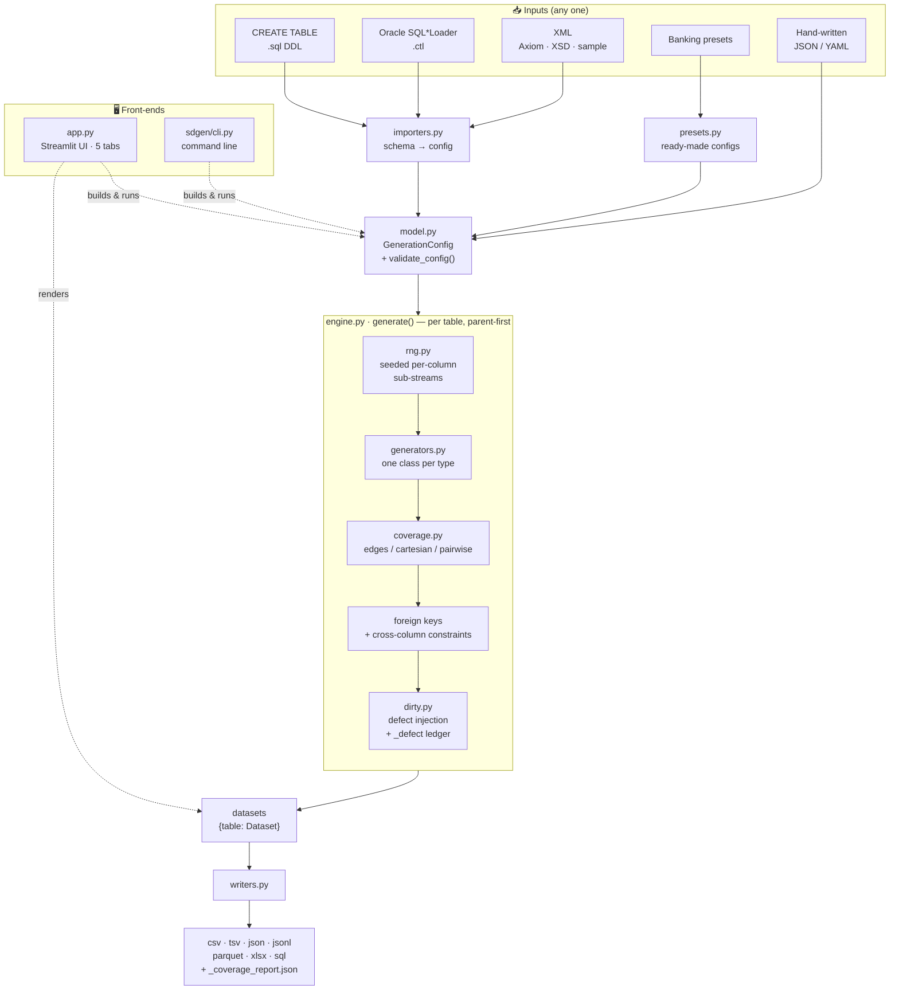

# 🛠️ Sample Data Generator — v4 (the superset)

The clean, do-everything version. One package (`sdgen`) that combines the breadth
of v1, the clean architecture of v2, and the polished UI from v3 — then goes
beyond all three. Generate **production-like sample data** from a schema, **plus
deliberate garbage rows** that break pipelines, with edge-case + combinatorial
coverage, multi-table foreign keys, cross-column constraints, and fully
reproducible seeded output. **Pure Python, no LLM.**

> Part of a 4-version comparison set:
> [v1](https://github.com/ankitjawla/sample-data-generator) ·
> [v2](https://github.com/ankitjawla/sample-data-generator-v2) ·
> [v3](https://github.com/ankitjawla/sample-data-generator-v3) · **v4 (this one)**

---

## Contents

- [Why this exists](#why-this-exists)
- [What makes v4 the superset](#what-makes-v4-the-superset)
- [Project diagram](#project-diagram)
- [Requirements](#requirements)
- [Install & run (how to run it)](#install--run-how-to-run-it)
- [The app — five tabs](#the-app--five-tabs)
- [Schema import — three formats](#schema-import--three-formats)
- [Banking presets](#banking-presets)
- [Configuration reference](#configuration-reference)
- [Column types](#column-types-25)
- [Dirty-data taxonomy](#dirty-data-taxonomy-13-kinds)
- [Coverage modes](#coverage-modes)
- [Cross-column constraints](#cross-column-constraints)
- [Foreign keys & referential integrity](#foreign-keys--referential-integrity)
- [Reproducibility model](#reproducibility-model)
- [Output formats](#output-formats)
- [Full config example](#full-config-example)
- [CLI](#cli)
- [Python library](#python-library)
- [Architecture & file-by-file guide](#architecture--file-by-file-guide)
- [Test data & examples](#test-data--examples)
- [Branding & theming](#branding--theming)
- [Testing & quality](#testing--quality)

---

## Why this exists

Most "fake data" tools only produce *valid* rows. But the hard part of testing a
data pipeline is proving it **rejects** the bad rows too. v4 generates both in one
pass:

- **Clean rows** — realistic, schema-valid, within ranges, referentially intact.
- **Dirty rows** — one deliberate defect each (stray delimiter, wrong type,
  out-of-range value, malformed email, broken foreign key, duplicate key, …),
  every defect **tagged in a `_defect` column** so your test knows exactly which
  rows *should* fail and why.

Everything is driven by a single **JSON or YAML config** plus a **seed**, so the
same inputs always produce byte-identical output — the config is the reproducible
artifact you check into git.

---

## What makes v4 the superset

| Capability | v1 | v2 | **v4** |
|---|:--:|:--:|:--:|
| Clean dataclass engine + plugin-registry generators | – | ✓ | ✓ |
| Multi-table foreign keys + referential integrity | – | ✓ | ✓ |
| Per-cell **defect ledger** (`_defect` column) | – | ✓ | ✓ |
| Per-column reproducible RNG sub-streams | – | ✓ | ✓ |
| **JSON _and_ YAML** config | YAML | JSON | **both** |
| Column types | 24 | 18 | **25** |
| Writers (CSV/TSV/JSON/JSONL/Parquet/XLSX/SQL) | ✓ | partial | **all 7** |
| Distributions (uniform/normal/exponential) | ✓ | partial | ✓ |
| **Cross-column constraints** (`start <= end`) | ✓ | – | ✓ |
| Fault/dirty taxonomy incl. `format_violation`, `broken_fk` | ✓ | ✓ | **union (13)** |
| Schema import: DDL + **SQL\*Loader .ctl** + **XML (Axiom/XSD/sample)** | DDL | DDL | **all 3** |
| Banking presets | ✓ | ✓ | ✓ |
| Enhanced UI: Guide tab, dirty-cell highlighting, charts, KPIs | ✓ | ✓ | ✓ |
| **Reviewed & hardened** (unique-exhaustion, path-traversal, FK determinism) | — | — | ✓ |

---

## Project diagram

How a schema becomes data. Inputs are turned into one `GenerationConfig`, the
engine generates every table (seeded values → coverage → foreign keys →
constraints → dirty injection), and the writers emit files. Both front-ends
(`app.py` and `sdgen.cli`) drive the exact same core.



> `types.py` underpins everything (the `LogicalType` / `DirtyKind` enums), and
> `__init__.py` re-exports the public API. See the
> [file-by-file guide](#architecture--file-by-file-guide) for the role of each module.

---

## Requirements

Only **Python 3** is needed to start — the launchers create a virtual
environment and install everything. Runtime dependencies (`requirements.txt`):

| Package | Used for |
|---|---|
| `streamlit>=1.40` | the web UI |
| `faker>=24.0` | realistic names, emails, companies, addresses, … |
| `pandas>=2.0` | Excel/Parquet writers and the preview grid |
| `openpyxl>=3.1` | `.xlsx` output |
| `pyyaml>=6.0` | YAML config (JSON works without it) |
| `pyarrow>=14.0` | `.parquet` output |
| `simple-ddl-parser>=1.13` | `CREATE TABLE` import |

Dev extra (`requirements-dev.txt`): `pytest>=8.0`.

---

## Install & run (how to run it)

There are four ways to run it — the **web UI** (easiest), the **CLI**, as a
**Python library**, or straight from the **bundled examples**.

### 1 · Web UI — one-click launchers (recommended)

The launchers create/reuse a `.venv`, install deps, and start the app on
**http://localhost:8504**.

| OS | Launcher |
|----|----|
| **Windows** | double-click `run.bat` (or `run.ps1`) |
| **macOS** | double-click `run.command` |
| **Linux** | `./run.sh` |

`run.sh` / `run.command` accept an optional port argument (`./run.sh 9000`).

Manual UI start (if you'd rather manage the environment yourself):

```bash
pip install -r requirements.txt
streamlit run app.py            # opens on http://localhost:8504
```

### 2 · CLI

```bash
pip install -r requirements.txt
python -m sdgen.cli generate config.json --out ./output --formats csv json
```

Full sub-command and flag list is in the [CLI](#cli) section.

### 3 · Python library

```python
from sdgen import load_config_file, generate
datasets = generate(load_config_file("config.yaml"))
```

See the [Python library](#python-library) section for the full API.

### 4 · From the bundled examples

```bash
# single table: import a CREATE TABLE into a config, then generate
python -m sdgen.cli import-ddl examples/exposures.sql --out examples/exposures.config.json
python -m sdgen.cli generate    examples/exposures.config.json --out ./output --formats csv

# multi-table with a foreign key (a ready-made config already ships)
python -m sdgen.cli generate    examples/banking_multi.config.json --out ./output --formats csv sql
```

### Run the tests

```bash
pip install -r requirements-dev.txt
pytest
```

---

## The app — five tabs

A flow across five tabs, with a sidebar for run-time overrides
(seed, dirty ratio, coverage mode + cap, output formats, CSV byte options).

1. **🚀 Start here** — a 3-step explainer, one-click worked examples
   (Banking exposures · Multi-table FK · Counterparties), and a glossary of every
   dirty-data kind, coverage mode, and column type.

2. **📥 Import / Presets** — paste an upstream interface document in any of three
   formats (see below) and the columns/types are drafted for you, or load a
   banking preset / append preset columns.

3. **🧱 Schema editor** — the imported (or preset) schema as an **editable grid,
   one row per column** — so you don't have to hand-edit JSON for a big pasted
   DDL/XML/SQL\*Loader file. Set each column's **data type** (dropdown), **length**,
   **expected values** (the enum domain), scale, nullable/unique, null %, weights,
   edge values, dirty examples/kinds, `params` (JSON for min/max/dates) and
   description; edit per-table row counts and cross-column constraints; add/remove
   columns; then **Apply** to write it back to the config. Multi-table configs get
   one grid per table (primary/foreign keys are preserved).

4. **🧩 Config (JSON/YAML)** — the reproducible source of truth. Edit it, hit
   **Validate**, and download as JSON **or** YAML. JSON and YAML are both accepted
   in the editor and auto-detected.

5. **▶️ Generate** — staged progress, then:
   - **dirty cells highlighted** (🟥 corrupted cell · 🟨 the `_defect` tag),
   - a row-view filter (**All / Dirty only / Clean only**),
   - a **"negative-test pack"** download (dirty rows only, CSV),
   - a **defect-mix bar chart** and **KPI cards** with a **Data-health verdict**
     (🟢 Pass / 🟡 Review),
   - a **foreign-key integrity** summary per relationship,
   - a 🔁 **Reproduce** popover (the exact config + CLI command),
   - a **pipeline-test teaching callout** with a pseudo-assertion, and
   - per-table CSV / JSON downloads.

---

## Schema import — three formats

The importer auto-maps types, lifts `CHECK (… IN …)` / `ENUM(…)` lists into
**expected values**, wires foreign keys, and applies **banking name heuristics**
(`…Amt`/`…Amount`/`…Bal` → decimal, `…Dt`/`…Date` → date, `…Rate`/`…Pct`/`…LGD`/
`…EAD`/`…CCF` → decimal, plus email/phone/name/company/address/city/country/
currency detection).

### 1 · `CREATE TABLE` DDL

Multi-table aware. `PRIMARY KEY` on an integer column becomes a `seq_id`,
`CHECK (col IN (...))` / `ENUM(...)` become enum columns whose `allowed_values`
are exactly those, `VARCHAR(n)` sets `max_length`, `DECIMAL(p,s)` sets `scale`,
and `REFERENCES other(col)` becomes a foreign key. Powered by `simple-ddl-parser`,
so most ANSI/Oracle/Postgres/MySQL/SQL-Server type names are recognised.

### 2 · Oracle SQL\*Loader control file (`.ctl`)

Parses `INTO TABLE`, the parenthesised field list, and per-field types
(`CHAR(n)`, `INTEGER`, `DECIMAL`, `DATE 'fmt'` → date, or → datetime when the
format has `hh/mi/ss`). `FILLER` / `CONSTANT` / `POSITION` / `WHEN` clauses are
skipped. Banking name heuristics fill in the rest.

### 3 · XML — auto-detected (Axiom / XSD / sample data)

A single paste box accepts any XML and auto-detects the flavour:

- **Axiom `DataSource` schema** — reads `object[type='DataSource:field']`
  properties (`name`, `type`, `allowNulls`, `isAutoUniqueId` → `seq_id`,
  `description`).
- **XSD (`xs:schema`)** — each `xs:element` becomes a column; `xs:enumeration`
  restrictions become enum `allowed_values`, `xs:maxLength` sets `max_length`,
  and `minOccurs="0"` / `nillable="true"` mark it nullable.
- **Sample XML data** — finds the repeated record element, then *infers* each
  field's type from its values (integers, decimals, ISO dates/datetimes), and
  treats low-cardinality fields (2–8 distinct values) as enums.

Pasted fragments without a single root element are tolerated.

> On the **CLI**, `import-ddl` covers the DDL case. `.ctl` and XML import are
> available in the UI and via the library functions `parse_sqlloader_ctl` and
> `parse_xml`.

---

## Banking presets

Ready-made regulatory templates (also available via `python -m sdgen.cli preset`):

| Preset | Contents |
|---|---|
| `basel_exposure` | single `exposures` feed (exposure class, on/off-balance flag, product type, amount, currency, country, rating, booking date) |
| `counterparty` | single `counterparties` table (legal name, LEI, country, sector) |
| `banking-dataset` | both tables, **linked by a foreign key** (`exposures.counterparty_id → counterparties.id`) |

The UI can also **append individual preset columns** — Exposure class, On/off-balance
flag, Currency code, Country code, Credit rating, Product type, Counterparty
sector, LEI code, Exposure amount, Booking date — each with sensible expected
values and fault examples baked in.

---

## Configuration reference

A whole run is one config object. Top level:

| Field | Type | Default | Meaning |
|---|---|---|---|
| `seed` | int | `42` | master seed — same seed ⇒ identical data |
| `locale` | str | `"en_US"` | Faker locale |
| `dirty_ratio` | float (0–1) | `0.0` | fraction of rows that get one defect each |
| `default_dirty_kinds` | list / null | `null` | global defect allow-list (per-type defaults if null) |
| `coverage` | object | `{mode: "edges"}` | combinatorial coverage spec |
| `emit_defect_labels` | bool | `true` | add the `_defect` column when defects exist |
| `tables` | list | `[]` | one or more table specs |

> A bare single table (`{"columns": [...]}`) is accepted and wrapped into a
> one-table config automatically.

**`coverage`:** `mode` (`off` · `edges` · `cartesian` · `pairwise`),
`columns` (restrict combination columns, default = all enum/boolean),
`cap` (max combination rows, default `5000`).

**table:** `name`, `rows` (default `1000`), `columns`, `primary_key` (list),
`foreign_keys` (list), `constraints` (list of `"a <= b"` rules).

**foreign key:** `column`, `ref_table`, `ref_column` (optional — defaults to the
parent's primary key, else its first unique column).

**column:**

| Field | Meaning |
|---|---|
| `name`, `type` | column name and [logical type](#column-types-25) |
| `params` | per-type knobs — `min`/`max`, `start`/`end`, `distribution`, `scale`, `min_length`/`max_length`, `step` |
| `allowed_values` | enum domain |
| `weights` | enum sampling weights (length must equal `allowed_values`) |
| `nullable`, `null_probability` | emit `null` with this probability |
| `unique` | enforce uniqueness (fails fast if the value space is exhausted) |
| `max_length`, `precision`, `scale` | size hints |
| `edge_values` | values that **must appear** (covered by the edges pass) |
| `dirty_kinds` | restrict which defects this column can get (else per-type default) |
| `dirty_examples` | forced bad values, occasionally injected verbatim |
| `description` | free text |

**Validation** (run before every generate) flags: no tables; `dirty_ratio`
outside 0–1; unknown coverage mode; duplicate table names; non-positive `rows`;
empty columns; an enum with no `allowed_values`; `weights`/`allowed_values`
length mismatch; `null_probability` outside 0–1; a column that is both `unique`
and `nullable`; and foreign keys that reference a missing column or table.

---

## Column types (25)

| Group | Types |
|---|---|
| Keys & numbers | `seq_id`, `integer`, `decimal`, `float` |
| Logical & temporal | `boolean`, `date`, `datetime` |
| Categorical & text | `enum`, `string`, `text`, `uuid` |
| People (Faker) | `name`, `first_name`, `last_name`, `email`, `phone` |
| Web / net (Faker) | `url`, `ipv4` |
| Org / place (Faker) | `company`, `job`, `address`, `city`, `country`, `postcode`, `currency` |

Per-type `params` worth knowing:

- `seq_id` — `start` (default 1), `step` (default 1).
- `integer` / `decimal` — `min`, `max`, and `distribution: "normal" | "exponential"`
  (default uniform). `decimal` rounds to `scale` (or `params.scale`, default 2).
- `float` — `min`, `max` (uniform).
- `string` — `min_length`, `max_length` (or `max_length` field).
- `date` / `datetime` — `start`, `end` (ISO date, or the literal `"today"`).
- `enum` — needs `allowed_values`; optional `weights`.

Faker types degrade gracefully to a simple fallback if Faker is unavailable.

---

## Dirty-data taxonomy (13 kinds)

Each defect is gated to the column types where it makes sense, recorded in a
ledger as `{row, column, kind}`, and folded into the `_defect` column as
`column:kind` (multiple defects joined with `|`).

| Kind | What it injects |
|---|---|
| `embedded_delimiter` | stray comma / quote / newline inside a field |
| `whitespace` | leading / trailing spaces |
| `null_variant` | `NULL` / `""` / `" "` / `"N/A"` where a value is required |
| `type_mismatch` | wrong type — e.g. `"thirty"` in a numeric column |
| `out_of_range` | value below `min` / above `max` |
| `format_violation` | malformed email / date / url / phone / ip / uuid |
| `leading_zero` | stripped leading zeros or scientific notation (`007`, `1.2E+10`) |
| `date_ambiguity` | ambiguous / invalid date (`03/04/2020`, `2023-13-45`) |
| `encoding` | unicode / mojibake / smart quotes / control characters |
| `invalid_enum_case` | wrong enum casing (`corporate` / `CORPORATE` / `Corp`) |
| `truncation` | value cut short |
| `duplicate_pk` | repeated value in a unique key |
| `broken_fk` | foreign key pointing at a non-existent parent row |

`duplicate_pk` is auto-eligible on unique columns and `broken_fk` on FK columns,
even if not listed in `dirty_kinds`.

---

## Coverage modes

A coverage pass guarantees important value combinations show up regardless of the
random draw. Combination columns are the enum (with `allowed_values`) and boolean
columns, optionally restricted by `coverage.columns`.

| Mode | Behaviour |
|---|---|
| `off` | no coverage pass — purely random rows |
| `edges` *(default)* | one row per boundary value per column (min/max/0, enum domain, first/last/leap-day dates, declared `edge_values`) |
| `cartesian` | every combination of the combination columns, **capped** at `coverage.cap` |
| `pairwise` | every *pair* of values co-occurs at least once — far fewer rows than cartesian |

---

## Cross-column constraints

Declare simple per-row rules on a table as `constraints: ["start_date <= end_date"]`.
Supported operators: `<=`, `<`, `>=`, `>` between two columns (numeric or ISO-date
strings). The engine **repairs** clean rows that violate a rule by ordering the two
values; mixed/incomparable types are skipped rather than raising. (Dirty injection
runs afterward, so a corrupted row may still break the rule on purpose.)

---

## Foreign keys & referential integrity

Tables are generated **parent-first** (topologically sorted; cyclic FKs are
detected and rejected). Each child FK column is filled from the parent's
**realised** keys, so clean child rows always reference a real parent. The
referenced key is chosen deterministically (declared primary key first, else the
alphabetically-first unique column), and parent `NULL`s are excluded from the
pool. The `coverage_report` reports `broken_refs` per relationship so you can
confirm integrity (or measure the orphans that `broken_fk` defects introduced).

---

## Reproducibility model

- One **master seed** drives everything.
- Each `(table, column)` gets a **stable sub-stream** derived from a CRC32 of its
  name XOR'd with the seed — so adding or removing a column doesn't reshuffle the
  others, and output is identical across processes (Python's salted `hash()` is
  deliberately avoided).
- Dirty injection and FK selection use their own labelled sub-streams.
- `"today"` resolves to a **fixed date** so date ranges are reproducible.

Result: the same config + seed produces **byte-identical** files. The
**🔁 Reproduce** popover and the `coverage_report` both echo the seed used.

---

## Output formats

Seven writers. The delimited writer (`CsvOptions`) gives byte-level control so a
defect can actually break a downstream parser.

| Format | Notes |
|---|---|
| `csv`, `tsv` | configurable delimiter, quoting, encoding, BOM, line ending, null token |
| `json`, `jsonl` | array of records / newline-delimited records |
| `sql` | `CREATE TABLE IF NOT EXISTS` + `INSERT`s, identifiers quoted, values escaped |
| `xlsx` | via pandas + openpyxl |
| `parquet` | via pandas + pyarrow |

**CsvOptions:** `delimiter` (default `,`), `quoting` (`minimal` · `all` ·
`nonnumeric` · `none` — use `none` to let an embedded delimiter shift columns),
`encoding` (`utf-8` / `latin-1` / `cp1252`), `bom`, `line_ending`, `null_token`.

Output filenames are **path-traversal-safe** (table/base names are reduced to a
basename). `write_all` also drops a `_coverage_report.json` next to the data.

---

## Full config example

JSON shown; the same structure works as YAML.

```json
{
  "seed": 42,
  "dirty_ratio": 0.08,
  "coverage": { "mode": "cartesian" },
  "tables": [
    { "name": "counterparties", "rows": 200, "primary_key": ["id"], "columns": [
        { "name": "id", "type": "seq_id", "unique": true },
        { "name": "legal_name", "type": "company" },
        { "name": "sector", "type": "enum", "allowed_values": ["Bank","Corporate","Sovereign"] } ] },
    { "name": "exposures", "rows": 5000,
      "foreign_keys": [ { "column": "counterparty_id", "ref_table": "counterparties", "ref_column": "id" } ],
      "constraints": ["start_date <= end_date"],
      "columns": [
        { "name": "exposure_id", "type": "seq_id", "unique": true },
        { "name": "counterparty_id", "type": "integer" },
        { "name": "exposure_class", "type": "enum",
          "allowed_values": ["Corporate","Institution","Retail","Sovereign"] },
        { "name": "on_balance_flag", "type": "enum", "allowed_values": ["ON","OFF"],
          "nullable": true, "null_probability": 0.05, "dirty_examples": [", ", "on"] },
        { "name": "exposure_amount", "type": "decimal", "params": {"min":0,"max":5000000}, "scale": 2 },
        { "name": "email", "type": "email" },
        { "name": "start_date", "type": "date", "params": {"start":"2015-01-01","end":"2020-01-01"} },
        { "name": "end_date", "type": "date", "params": {"start":"2020-01-01","end":"today"} } ] }
  ]
}
```

---

## CLI

```bash
python -m sdgen.cli validate    config.json                 # or config.yaml
python -m sdgen.cli generate    config.yaml --out ./output --formats csv tsv parquet xlsx sql
python -m sdgen.cli import-ddl  schema.sql  --out config.json
python -m sdgen.cli preset      banking-dataset --out config.json
python -m sdgen.cli preset      list                        # show available presets
```

`generate` flags: `--out --formats --rows --seed --coverage-mode --dirty-ratio
--delimiter --quoting {minimal,all,nonnumeric,none} --encoding --bom
--line-ending {unix,windows}`. Any of `--seed/--rows/--coverage-mode/--dirty-ratio`
override the config. Pass `-` as the config path to read from stdin.

---

## Python library

```python
from sdgen import load_config_file, validate_config, generate, coverage_report
from sdgen.writers import write_all, CsvOptions

cfg = load_config_file("config.yaml")          # JSON or YAML auto-detected
assert not validate_config(cfg)                 # [] means valid
datasets = generate(cfg)                         # {table_name: Dataset}
write_all(datasets, "./output", formats=["csv", "parquet"],
          csv_options=CsvOptions(quoting="none"),
          report=coverage_report(cfg, datasets))
```

A `Dataset` has `.table`, `.header`, `.rows` (list of dicts), and `.defect_ledger`.
Schema importers are exposed too:

```python
from sdgen.importers import parse_ddl, parse_sqlloader_ctl, parse_xml
from sdgen.presets import preset_config, list_presets

cfg = parse_xml(open("feed.xsd").read())         # auto-detects Axiom / XSD / sample
cfg = preset_config("banking-dataset")
```

---

## Architecture & file-by-file guide

A plugin-registry engine: adding a column type is a single class — the engine,
importers, and writers never change. Full tree:

```
sample-data-generator-v4/
├── app.py                      # Streamlit web UI (5 tabs)
├── requirements.txt            # runtime dependencies
├── requirements-dev.txt        # runtime deps + pytest
├── run.sh / run.command        # macOS / Linux launchers
├── run.bat / run.ps1           # Windows launchers
├── .streamlit/config.toml      # indigo theme + settings
├── sdgen/                      # the engine package
│   ├── __init__.py             # public API exports + __version__
│   ├── types.py                # enums: LogicalType (25), DirtyKind (13), formats
│   ├── model.py                # config dataclasses + JSON/YAML IO + validation
│   ├── rng.py                  # seeded, CRC32-stable per-column RNG sub-streams
│   ├── generators.py           # plugin registry — one class per logical type
│   ├── coverage.py             # edges / cartesian (capped) / greedy pairwise
│   ├── dirty.py                # dirty-data taxonomy + per-cell defect ledger
│   ├── engine.py               # orchestrator: clean → coverage → FK → constraints → dirty
│   ├── importers.py            # DDL + SQL*Loader .ctl + XML (Axiom / XSD / sample)
│   ├── writers.py              # csv/tsv/json/jsonl/parquet/xlsx/sql writers
│   ├── presets.py              # banking configs + reusable preset columns
│   └── cli.py                  # command line: generate/validate/import-ddl/preset
├── tests/test_sdgen.py         # pytest suite (23 tests)
├── examples/                   # sample schemas + configs (see Test data)
└── assets/                     # optional brand logos + branding README
```

### What each file does & why it's there

| File | What it does | Why it exists (purpose) |
|---|---|---|
| **`app.py`** | The Streamlit UI: five tabs (Start here · Import/Presets · **Schema editor** · Config · Generate), sidebar overrides, the per-column grid editor, dirty-cell highlighting, KPI cards, FK-integrity panel, charts, downloads. | A no-code front-end so non-developers can produce test data, refine the schema visually, and see exactly which rows are dirty and why. |
| **`sdgen/__init__.py`** | Re-exports the public API (`generate`, `load_config_file`, `validate_config`, `coverage_report`, the dataclasses, the enums) and defines `__version__`. | Single, stable import surface — `from sdgen import generate`. |
| **`sdgen/types.py`** | Defines the core enums: `LogicalType` (25 column types), `DirtyKind` (13 defect kinds), `OutputFormat`, the coverage-mode list, and the per-type "which defects are valid" gating maps. | The shared vocabulary every other module speaks; keeps types/defects in one place. |
| **`sdgen/model.py`** | The config object model — `GenerationConfig`, `TableSpec`, `ColumnSpec`, `ForeignKey`, `CoverageSpec` dataclasses — plus JSON/YAML load/dump (`load_config`, `to_json`, `to_yaml`) and `validate_config`. | Turns text config into validated, typed objects; the config *is* the reproducible artifact. |
| **`sdgen/rng.py`** | `RngBundle` — derives a stable random sub-stream per `(table, column)` from the seed via CRC32, and a seeded Faker instance. | Reproducibility: same seed ⇒ identical output, and adding a column doesn't reshuffle the others. |
| **`sdgen/generators.py`** | A plugin registry mapping each `LogicalType` to a `ValueGenerator` class (`next()` + `boundary_values()`), including all Faker-backed semantic types. | Extensibility: add a type by writing one class; nothing else changes. |
| **`sdgen/coverage.py`** | Builds combinatorial coverage rows — `edges`, capped `cartesian`, or greedy `pairwise` over enum/boolean columns. | Guarantees boundary values and important combinations appear regardless of the random draw. |
| **`sdgen/dirty.py`** | Injects one defect into a `dirty_ratio` share of rows (gated to sensible kinds per column) and records every defect in a `{row, column, kind}` ledger. | Produces the deliberate "garbage" rows and labels them so tests know what *should* fail. |
| **`sdgen/engine.py`** | The orchestrator: topologically sorts tables (parent-first), fills clean values, runs coverage, wires foreign keys from real parent keys, repairs cross-column constraints, injects dirty data, and builds each `Dataset` + the `coverage_report`. | The heart that ties RNG, generators, coverage, FKs, constraints, and dirty injection into one deterministic pass. |
| **`sdgen/importers.py`** | Parses an upstream schema into a `GenerationConfig`: `parse_ddl` (CREATE TABLE), `parse_sqlloader_ctl` (Oracle `.ctl`), and `parse_xml` (auto-detects Axiom DataSource / XSD / sample XML), with banking name heuristics. | Lets you start from a real interface document instead of hand-writing a config. |
| **`sdgen/writers.py`** | Renders/writes the seven output formats (csv, tsv, json, jsonl, sql, xlsx, parquet) via `write_dataset`/`write_all`; `CsvOptions` gives byte-level CSV control; filenames are path-traversal-safe. | Gets data out in whatever a downstream pipeline consumes, and can produce files that genuinely break a parser. |
| **`sdgen/presets.py`** | Banking/regulatory column factories, single-table presets (`basel_exposure`, `counterparty`) and the multi-table `banking-dataset` (parent + child + FK). | Instant, realistic starting points with expected values and fault examples baked in. |
| **`sdgen/cli.py`** | The argparse command line: `generate`, `validate`, `import-ddl`, `preset`. | Headless/scriptable use in CI and pipelines. |
| **`tests/test_sdgen.py`** | 23 pytest tests covering determinism, coverage, FK integrity, constraints, YAML round-trip, every type, all writers, every importer, and the hardening fixes. | Proves the engine behaves and stays reproducible. |
| **`run.sh` · `run.command` · `run.bat` · `run.ps1`** | Cross-platform launchers that create/reuse `.venv`, install deps, and start the app on port 8504. | One-click start with zero manual setup. |
| **`.streamlit/config.toml`** | The indigo theme and Streamlit settings (usage stats off). | Consistent v4 branding. |
| **`requirements*.txt`** | Pinned dependency lists (runtime, and `-dev` adds pytest). | Reproducible installs. |
| **`assets/`** | Optional brand logos (`capgemini.*` / `barclays.*`) and a branding README. | Drop-in logos for the header (see [Branding](#branding--theming)). |
| **`examples/`** | Sample DDL schemas and configs (see [Test data & examples](#test-data--examples)). | Ready-to-run inputs to learn the tool. |

> Note: `sdgen/ui/` is an empty placeholder — the entire UI lives in `app.py`.

---

## Test data & examples

There are two kinds of test data in the repo: **runnable example inputs** in
`examples/`, and **self-contained fixtures** embedded in the test suite.

### `examples/` — runnable sample inputs

| File | What it is | How to use it |
|---|---|---|
| `exposures.sql` | A single-table `CREATE TABLE` for a banking exposure feed — `PRIMARY KEY`, two `CHECK (… IN …)` enum lists, `DECIMAL(18,2)`, an `email` column. | `python -m sdgen.cli import-ddl examples/exposures.sql --out examples/exposures.config.json` |
| `exposures.config.json` | A hand-tuned config for that table — **500 rows**, **8% dirty**, **cartesian** coverage, per-column `dirty_kinds`/`dirty_examples`, and `edge_values` (`0`, `0.01`, leap-day `2020-02-29`). | `python -m sdgen.cli generate examples/exposures.config.json --out ./output --formats csv` |
| `banking_multi.sql` | A two-table schema: `counterparties` (parent) and `exposures` (child) linked by `REFERENCES counterparties(id)`. | `python -m sdgen.cli import-ddl examples/banking_multi.sql --out my.config.json` |
| `banking_multi.config.json` | The config produced from that DDL — parent + child with the foreign key wired, ready to generate. | `python -m sdgen.cli generate examples/banking_multi.config.json --out ./output --formats csv sql` |

Running either config produces clean rows plus tagged dirty rows (and, for the
multi-table example, a foreign-key integrity check in the coverage report).

### Test fixtures — `tests/test_sdgen.py`

The 23-test suite needs **no external data files**: each test builds its own
input inline. Engine/coverage/FK tests construct configs with a small `_cfg(...)`
helper (a `seq_id` PK + two enums + a decimal), and the importer tests embed
representative schema snippets and assert on the parsed result:

| Test | Embedded sample | Checks |
|---|---|---|
| `test_ddl_import_to_config` | a `CREATE TABLE` with `CHECK`/`REFERENCES` | enum + FK mapping |
| `test_sqlloader_ctl_import` | an Oracle `.ctl` (`RetPrcnt`, `AppTyp CHAR(10)`, `MatDt DATE`…) | type + length + name heuristics |
| `test_axiom_xml_import` | an Axiom `DataSource` XML fragment | `isAutoUniqueId` → `seq_id`, `allowNulls` |
| `test_xml_xsd_import` | an `xs:schema` with an enumeration restriction | element types, `minOccurs` nullability, enum |
| `test_xml_sample_import` | a sample `<exposures>` data document | type inference + low-cardinality → enum |

Run them all with `pytest` (after `pip install -r requirements-dev.txt`).

> Generated output (the `output/` directory) is git-ignored — it's a build
> artifact, not source.

---

## Branding & theming

The header shows a brand wordmark on each side of the title. Defaults are
`Capgemini` (left) and `Barclays` (right) and can be overridden via the
`SDG_BRAND_LEFT` / `SDG_BRAND_RIGHT` (and `…_TAG`) environment variables, or by
dropping `assets/capgemini.*` / `assets/barclays.*` image files (PNG/SVG/JPG/WEBP,
embedded as base64 — no hosting needed). Set a brand to `""` to hide that side.
The indigo theme lives in `.streamlit/config.toml`.

> These names ship in a public repo — edit the constants near the top of `app.py`
> or set the env vars to use your own company/client.

---

## Testing & quality

Built from a code review of v1–v3 (51 confirmed findings). v4 fixes the
highest-impact ones:

- unique-column exhaustion now **fails fast** instead of silently emitting duplicates;
- output filenames are **path-traversal-safe**;
- foreign-key target selection is **deterministic** (prefers the primary key);
- parent `NULL`s are excluded from FK pools;
- the UI **catches generation errors** instead of crashing.

The `pytest` suite (23 tests) covers determinism, edges/cartesian/pairwise
coverage, multi-table FK integrity, cross-column constraints, JSON **and** YAML
round-trips, every new column type, format-violation defects, all seven writers,
each schema importer (DDL · SQL\*Loader · Axiom XML · XSD · sample XML), and the
hardening fixes above.

```bash
pip install -r requirements-dev.txt && pytest
```
